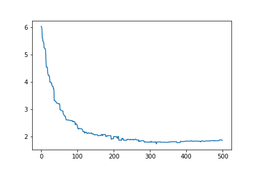

# SOM
Self-Organising Map implementation in Python.
Some parts of the code are inspired by [MiniSom](https://github.com/JustGlowing/minisom/blob/master/minisom.py).

This version of SOM has rectangular architecture and can use custom distance measures.
To use custom distances just write the code of your distance measure and initialize the SOM object with the parameter "distance_function" equal to your function.

Example:
` def euclidean_distance(x, w):
    return norm(np.subtract(x,w), axis = -1)`
Then in your code:
` 
som = SOM(7,7,np.shape(x)[1],0.1,0.8,5000,euclidean_distance)
`

---
These are the results on the Iris Dataset using:

- Euclidean Distance
- Learning rate = 0.1
- Sigma = 0.8 
- Epochs = 5000

MAP                        |  QUANTIZATION ERROR
:-------------------------:|:-------------------------:
  |  

---
These are the results on the Iris Dataset using:

- Cosine Distance
- Learning rate = 0.1
- Sigma = 0.8 
- Epochs = 500

MAP                        |  QUANTIZATION ERROR
:-------------------------:|:-------------------------:
  |  

---
These are the results on the Iris Dataset using:

- Manhattan Distance
- Learning rate = 0.1
- Sigma = 0.8 
- Epochs = 5000

MAP                        |  QUANTIZATION ERROR
:-------------------------:|:-------------------------:
  |  
